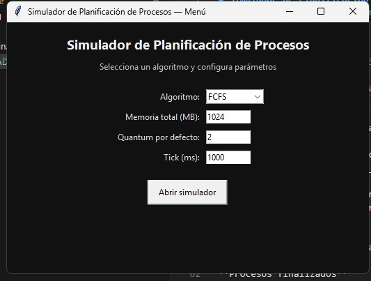
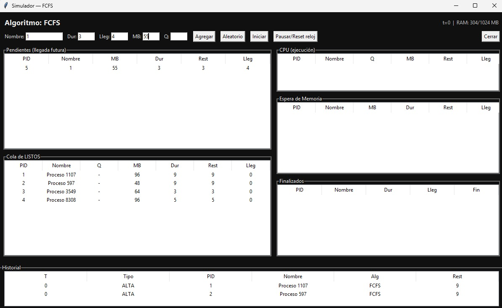
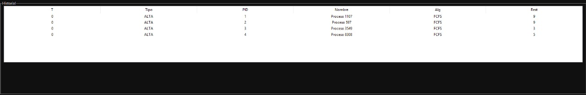
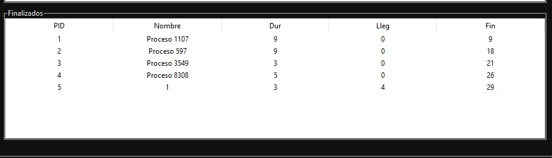

# Simulador de Planificación de Procesos (1 CPU • RAM limitada)

Aplicación en Python que simula la planificación de procesos en un SO con una sola CPU y memoria finita, mostrando de forma clara cómo entran, esperan, ejecutan y finalizan bajo diferentes algorítmos (FCFS, SJF, SRTF y RR).
---

## 1. Descripción general

El simulador abre con un menú inicial donde eliges el algoritmo, la memoria total (MB), el quantum por defecto (si aplica) y el tick en milisegundos.  
Luego muestra una interfaz  con estos paneles fijos:

- **Pendientes (llegada futura)**  
- **Cola de listos**  
- **CPU (en ejecución)**  
- **Espera de memoria** (procesos que no caben en RAM)  
- **Finalizados**  
- **Historial** de eventos: `ALTA`, `EJEC`, `PREEM`, `FIN`

**Reglas clave:**
- Se respeta el instante de llegada.  
- En FCFS: primero el que llegó antes (empate → orden de alta).  
- En SJF (no expropiativo): entre los que ya llegaron, **menor duración** primero (empate → llegada, luego orden).  
- En **SRTF**: **expropiativo** por menor **restante**.  
- En **Round Robin (RR)**: **quantum** por proceso (si no se especifica, toma el valor por defecto del menú).

---

## 2. Tecnologías

- **Python 3.8+** (probado también en 3.10/3.11)  
- **tkinter** (incluido con Python en la mayoria de instalaciones)  
- Requiere que instales matplotlib

---

## 3. Instalacion y ejecución

# 1) Clonar (o descargar el zip)
git clone https://github.com/Javier031/Proyecto2SO.git
cd Proyecto2SO/Proyecto2SO

# 2) Ejecutar
py main.py
# (en linux/macos puede ser: python3 main.py, aunque depende siempre de la version de python)

## 8. Capturas del funcionamiento

acontinuación algunas capturas referenciales del simulador. 

**Menú de arranque**  

**Simulador con procesos en cola de listos**  

**Historial**  

**Procesos finalizados**  

